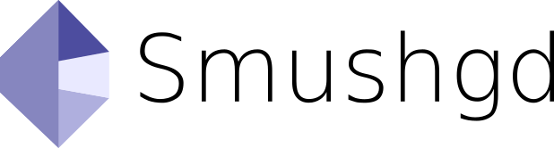

# 

## Description
Smushgd is a plugin for the Godot game engine. Smushgd tries to ease the use of 3D models in a 2D context. Specifically, 3D models with skeletal animations. This plugin attempts to visually "smush" them down in to a 2D sprite without losing the skeletal information.

## Usage
The Smushgd plugin will add 2 nodes to Godot. The "Smushgd" node and the "Smushgd Attachment" node. 

### Nodes
#### Smushgd
This node will contain the assets associated to the resulting sprite. Droping in a "Spacial" node will render that node as a 2D sprite. 
##### Options:  
 - Is Skeleton Debug: This option enables drawing the 3D skeleton for visual debugging.
 - Cast Shadow: This option will add a light occluder to the skeleton.
 - Resolution: X and Y pixel dimentions of the resulting sprite.
#### Smushgd Attachment
This node is meant to be nested directly inside a "Smushgd" node. This node is meant to hold other assets you would like to attach to a specific bone in a 3D skeleton. 
##### Options:
 - Bone Index: The bone this "Smushgd Attachment" will track to.
 - Use Rotation: Rotate children according to the rotation of the Bone this "Smushgd Attachment" is associated with.
 - Use Rot Offset: Include the rotation of the children sprites in rotational tracking calculation
 - Use Pos Offset: Include the position of the children sprites in positional tracking calculation

